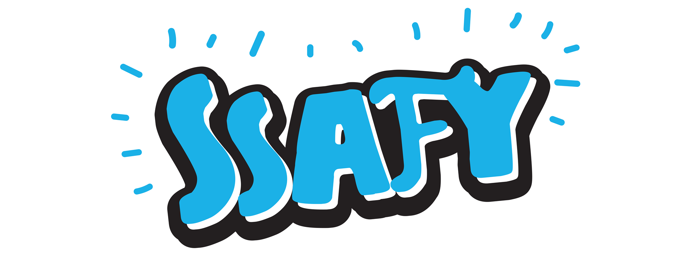

# TIL

정규 과정 외에 따로 공부한것들이 올라옵니다.

정규 과정 학습내용은 [여기](https://www.notion.so/SSAFY-14-23716d6ec14380a88ae3eb8cfd7152fb?source=copy_link)에 있습니다.

정규 과정 중 궁금했던 것, 실수했던 것 심화학습 한 것 위주로 업로드 됩니다.

## Python
- [f-string 심화학습](./f-string%20심화%20학습.md)

## git
- [git restore](./git_restore에%20대해.md)

- [git push, upstream](./git_push%20실패%20에러%20해결과%20upstream%20에%20대해.md)

# web

## html

## CSS

## javascript

## Django

## spring